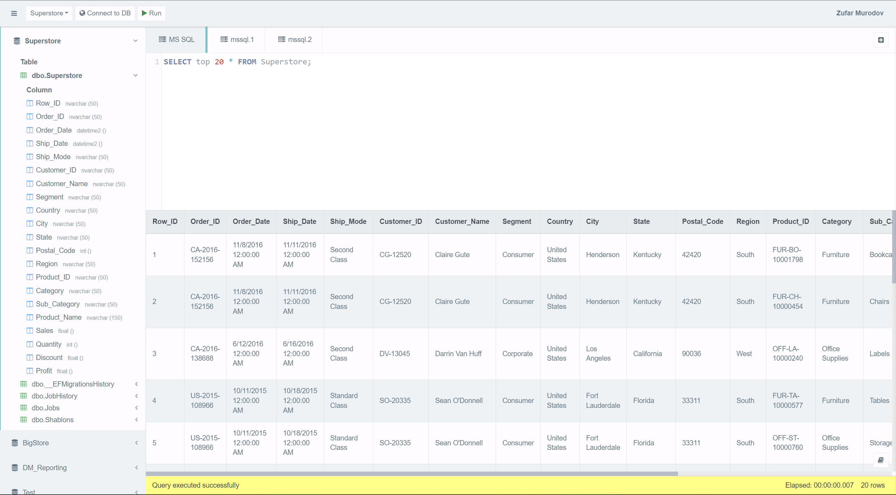
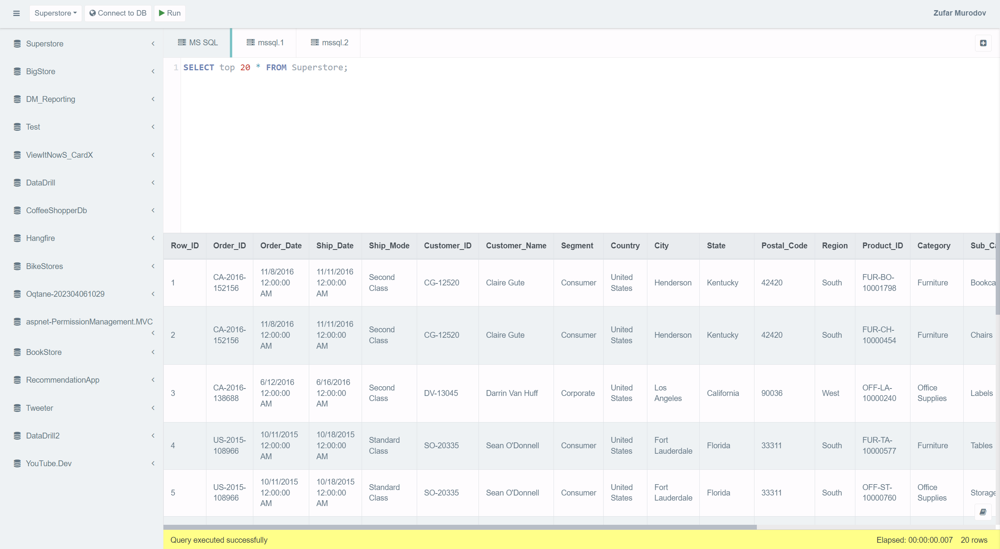

## MSSQL Server Management Studio

### Description

This online sql editor is a web based tool to edit and execute sql queries or scripts online. It allows to create, edit, and delete database objects such as tables, views, indexes, constraints, stored procedures, functions, triggers, and much more (in beta release).
This tool is developed using ASP.NET Core 3.1 MVC. Cloned from https://sqliteonline.com/ and modified to support MSSQL Server :). Completed in 1 week.

### Features

- Connect to MSSQL Server using login password.
- See all databases in the server with tables.
- Selecting database and executing sql queries.
- Can create multiple tabs to execute multiple queries.
- Create, edit, and delete database objects such as tables, views, indexes, constraints, stored procedures, functions, triggers, and much more (in beta release).
- Shows execution time and other statistics.
- Shows query results in a table.

### Some screenshots




### Demo video:
https://drive.google.com/file/d/18JP0OIuz3v87cgjxndceyH8nHxrqtRBv/view?usp=sharing

## Installation

To set up the project locally, follow these steps:

1. Clone the repository using the following command:

```bash
git clone https://github.com/zmurodov/sqlms.git
```

1. Navigate to the project directory:

    ```bash
    cd sqlms
2. Restore the required NuGet packages:

    ```bash
    dotnet restore
3. Build the solution:

    ```bash
    dotnet build

4. Run the project:

    ```bash
    dotnet run


## Usage
Open your web browser and navigate to the running application.
